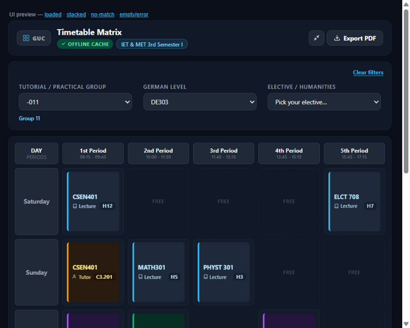
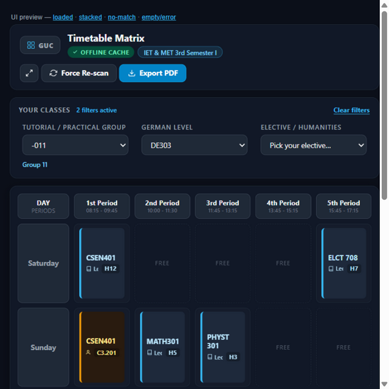
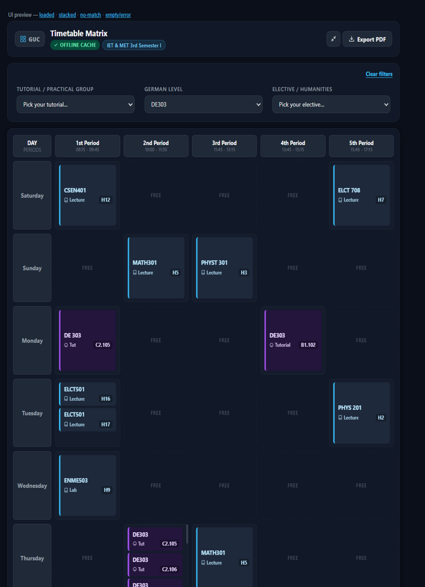
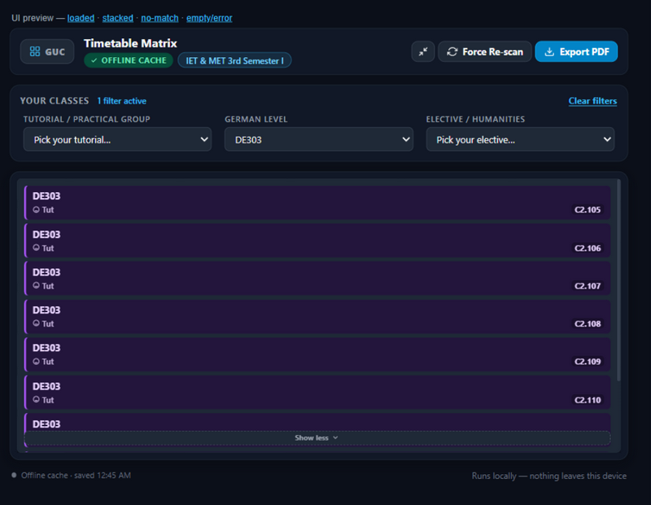
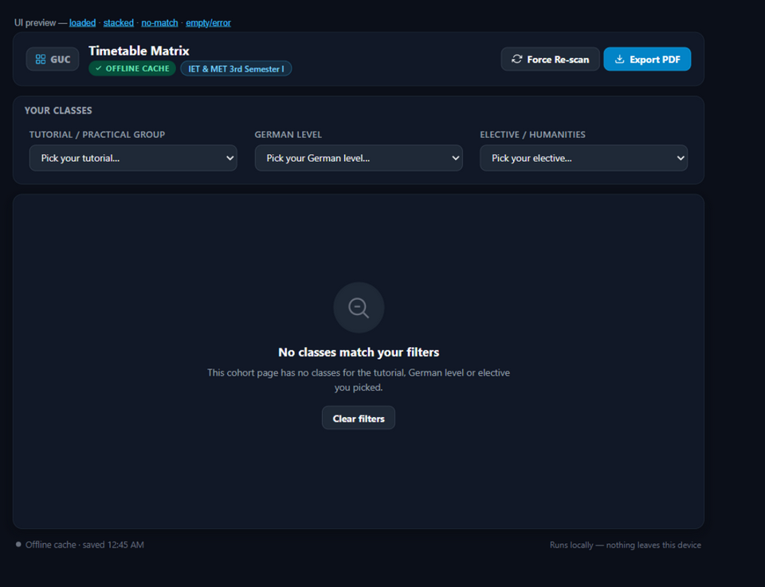
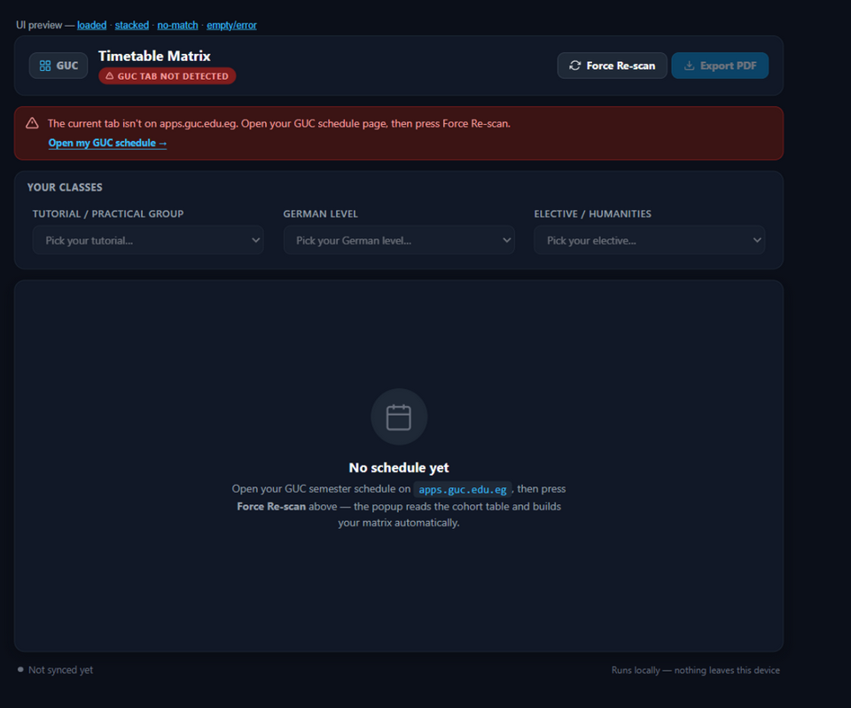

# GUC Timetable Matrix Extension

A Manifest V3 Chrome extension that turns the cluttered, cohort-wide HTML
schedule on `apps.guc.edu.eg` into a personalized, color-coded 6-day
(Saturday–Thursday) timetable — with one-click PDF export and a
built-in group-code translator.

**Cost: $0.** No account, no API key, no subscription, no credit card, ever.
Everything runs as a local script inside your own browser. Your GUC login
and schedule data never leave your machine — there is no server, no
analytics, and no network request of any kind built into this extension.

---

## What's new in v4.2

- **Two layouts, one toggle.** The popup opens in the classic **maximized**
  layout from the main branch — 780px wide, roomy 130px class cards with
  the internal scroll slider, Force Re-scan in the footer, Export as a
  quiet secondary button. The icon button in the header minimizes it to
  the **compact v4.0 layout** (640px) — header actions, the "Your
  classes" filter row with Clear filters, +N more chips on crowded cells,
  and today's-day highlight. Your choice is remembered across sessions.
- **Opens full-size every time.** Earlier builds sized the popup body
  relative to the viewport, which on the live portal could collapse into
  a ~250px-wide strip with everything stacked vertically. Both layouts
  now use fixed pixel widths (780/640, under Chrome's 800px popup cap),
  so the window always opens at full size with no squeezed first render.
- **Polish from the community audit:** dropdown options are built with
  DOM APIs instead of `innerHTML`, rapid filter flips no longer restart
  the grid's entrance animation (80 ms debounce), and the origin of the
  compound-fixture `ME-11` group key is now documented in the test suite.

---

## What's new in v4.0

- **The Tutorial/Practical dropdown only offers real cohort groups.** The
  portal stacks the German course's parallel sections (e.g. nine `DE303`
  rows tagged `T016`–`T024`) inside one period cell, and those German-class
  section numbers used to be registered as tutorial-group options. Picking
  one as "your tutorial" matched none of your real tutorials and silently
  emptied the grid. A group key now enters the dropdown only if it appears
  on a non-German row; German rows contribute only their level. The
  filtering engine is untouched — when a selected cohort group happens to
  coincide with a German section tag, German still narrows to that room,
  and it still widens to the whole level otherwise.
- **Dead saved selections clear themselves.** A tutorial/level/elective
  remembered from an older parser version (or a different cohort page) is
  dropped at load instead of filtering the grid against a group that no
  longer exists. The cache is version-stamped (`parserVersion: 4`), so
  updating the extension is enough.
- **A deliberate header.** The cohort chip and live status sit under the
  title; **Force Re-scan** moved up next to a filled **Export PDF** button,
  so both main actions are one glance away.
- **A filter bar that explains itself.** "Your classes" with a live
  *N filters active* hint, clearer dropdown placeholders, and a
  **Clear filters** control that appears the moment anything is selected.
- **Honest timetable cells.** Crowded cells keep the thin internal
  scroll "slider" they always had, and a sticky **+N more** chip now makes
  the overflow explicit — click it and the cell expands in place to show
  every colliding class at once ("Show less" collapses it back).
- **Rewritten states.** A friendlier no-data screen, a new *No classes
  match your filters* screen with its own Clear-filters button, clearer
  scan/error copy, and a footer that says where the data came from
  ("Offline cache · saved 12:45") and the privacy promise
  ("Runs locally — nothing leaves this device").
- **Export with feedback.** The button shows *Exporting…* while the PDF
  renders, a toast confirms success, and failures land in a red error
  toast instead of a dead click.
- **Accessibility & responsive polish.** Visible keyboard focus rings on
  every control, ARIA live regions for status/toast/filter hint,
  `aria-expanded` on the +N more chips, all animation disabled under
  `prefers-reduced-motion`, and the header/filters stack cleanly on narrow
  windows. Today's day is quietly highlighted in the grid.
- **Screenshots** live in [`screenshots/`](screenshots/) — captured from
  the real popup via `tests/ui-preview.html`:

  | | |
  |---|---|
  |  |  |
  |  |  |
  |  |  |

---

## What's new in v3.1

- **A clean empty schedule.** With nothing chosen in the dropdowns, the
  grid and the generated PDF now show *only* your cohort lectures. German
  and elective rows that sit in a hall room (e.g. `CPS402 T031 H8`) used
  to slip in through the "lectures always show" rule — they're
  dropdown-filtered classes, not cohort lectures, and they stay out until
  you pick their German level or elective track.
- **v3.1.1 — correct faculty names.** The group-code translator now reads
  `MET` as *Media Engineering & Technology* and `IET` as *Information
  Engineering & Technology* (they were misregistered as Mechanical /
  Industrial).

---

## What's new in v2.1.1

- **Lectures can no longer disappear.** Previous versions guessed which
  major a cohort lecture "belongs to" (course-code prefix, row faculty
  tag, then both) and hid it from students of other majors. On the real
  portal — combined cohorts like *IET & MET*, cross-listed rows, untagged
  rows — that guess kept hiding lectures you actually attend, and which
  lectures vanished changed depending on which tutorial you had
  selected. The guessing is gone: every lecture on your cohort's page
  now stays visible no matter what you pick in the dropdowns; the
  dropdowns only filter your tutorial/German/elective rows. The tradeoff
  is deliberate — on a combined-cohort page you may also see a lecture
  that only the other major attends (clutter you can ignore) instead of
  silently missing one of your own classes.

---

## What's new in v2.1.0

- **Your cohort's name, front and center.** The popup now reads the
  portal's own schedule-type dropdown (the one that says e.g.
  *"IET & MET 3rd Semester I"*) and shows it as a chip in the header, so
  you can confirm at a glance that you're looking at the right cohort.
- **Force Re-scan actually re-scans.** Tabs that were opened *before* the
  extension last reloaded never received the content script, so re-scan
  used to fail with a dead message channel. The popup now injects the
  parser into the tab on demand and retries once — no more manual tab
  reloads.
- **Export is now a PDF.** One click downloads a clean A4-landscape PDF
  of exactly the grid you're looking at — cohort name as the title, your
  selected group/German level in the subtitle, color-coded slot cards
  with rooms. The old `.ics` calendar export (and its import
  instructions) are gone; the PDF needs no importing anywhere.
- **Tests cover the new surface.** The offline suite now also pins down
  cohort-name extraction (including the whitespace-collapsing fallback
  for the portal's embedded-newline option labels) and the byte-level
  structure of the generated PDF (header, DCTDecode image, MediaBox,
  xref offset).

---

## What's new in v2.0.2

- **Lectures no longer vanish when you pick a tutorial group.** v2.0.1
  stamped every cohort lecture with its row's faculty tag — which is right
  for cross-listed lectures but wrong for *service* courses (math, physics,
  humanities…) that the portal renders inside one faculty's rows for
  everyone. A service lecture filed in a row tagged for another faculty was
  silently filtered out. Now the row tag decides the audience only when the
  course prefix is a real faculty code (`ELCT 708` under a MET row → MET);
  any other prefix (`MATH301`, `PHYS 201`, `PHYSt 301`) keeps the lecture
  visible to every group.
- **German no longer disappears when both dropdowns are set.** Your German
  group number is independent of your tutorial group number — so with both
  selected, your German row usually matched neither rule and silently
  vanished. Now: when the tutorial selection happens to match a room of the
  selected German level, the view keeps narrowing to that one room;
  otherwise the level widens back to all of its rooms so the class is
  always shown.
- **Old caches discard themselves.** Slots parsed by an older version
  survive extension reloads in `chrome.storage.local` and used to mask
  parser fixes until a manual re-scan. The cache is now stamped with a
  parser version and dropped on mismatch, so updating the extension is
  enough — your next scan rebuilds the schedule with the fixed parser.

---

## What's new in v2.0.1

- **German is German again.** The portal renders course codes with a space
  (`DE 303`, same style as `ELCT 708`) — the raw string comparison against
  the level list never matched, so German rows never registered in the
  German dropdown and were only reachable through their tutorial tag (and
  styled like tutorials). Course-code comparisons now go through one shared
  normalizer (`normalizeCourseCode`), and a German row renders with the
  German badge even when its primary token is its tutorial tag.
- **Cross-listed lectures no longer vanish.** A cohort lecture's target
  major is now read from the row's own faculty tag (`3 MET III 3G`) when
  present, falling back to the course-prefix guess only for tagless cells.
  Previously a lecture like `ELCT 708` (Electric Machines) rendered for
  another cohort was hidden from exactly the students attending it,
  because its `ELCT` prefix didn't match their major.
- **Mixed-case course codes parse.** Portal rows like `PHYSt 301 Lecture`
  used to fail the course-code regex entirely and degrade to `GENERAL` —
  the regex now tolerates stray lowercase letters and the code is
  uppercased downstream.

---

## What's new in v2.0.0

- **Saturday is back.** GUC's academic week is Saturday–Thursday; v1 had a
  bug where Saturday classes were scraped correctly but silently dropped
  from the rendered grid and `.ics` export. Fixed at the root: day/period
  constants now live in one shared file (`shared-constants.js`) instead of
  two separate, hand-copied arrays that could drift apart.
- **No more duplicate/junk entries.** Cells with a nested `<table>` (common
  for multi-line slots) used to get parsed twice — once correctly, once as
  meaningless "GENERAL"/"TBA" noise. The parser now does a proper two-pass
  extraction so each cell yields exactly the slots that are actually there.
- **Tutorial and Practical sections are unified.** `T041` and `P041` are
  recognized as the same section (a tutorial/practical pairing sharing one
  group number), not two separate lookups.
- **Real German/elective categories.** German is exactly 4 levels
  (`DE101`–`DE404`); electives/humanities are exactly 5 tracks (`AE`, `AS`,
  `SM`, `CPS`, `RPW`). The dropdowns and classification logic are built
  around these lists instead of guessing from substrings.
- **Group-code translator.** Pick a tutorial/practical group and the popup
  shows a plain-English decode underneath the dropdown, e.g.
  *"Mechatronics Engineering — 5th Semester — Group 41."*
- **Cohort lectures no longer bleed across majors.** A wide, ungrouped
  lecture cell is now matched against the major implied by your selected
  tutorial/practical group, so another department's cross-listed lecture
  doesn't show up in your grid. *(Reverted in v2.1.1 — the major matching
  hid real lectures; see above.)*
- **No more overflowing cells.** When 3+ classes collide in one time slot
  (e.g. alternating labs), the cell now scrolls internally at a fixed
  height instead of expanding and bleeding into the row below.

---

## 1. What's in this repo

```
guc-timetable-matrix/
├── manifest.json           # Manifest V3 config
├── shared-constants.js     # Single source of truth: days, periods, German/elective lists
├── content.js               # DOM parser — reads the schedule table on the page
├── icons/                   # Toolbar icons (16/48/128px)
├── screenshots/             # Popup UI screenshots (captured from ui-preview.html)
├── popup/
│   ├── popup.html           # Popup UI shell
│   ├── popup.js               # State, rendering, filtering, translator, PDF export
│   └── popup.css               # Dark theme
├── tests/
│   ├── test-harness.html    # Browser test page (button → assertions + raw JSON)
│   ├── ui-preview.html      # Dev-only visual preview of the popup UI (loaded / stacked / empty states)
│   ├── node-runner.js       # Headless runner for the exact same suite (`npm test`)
│   ├── fixtures.js          # Fixture markup: synthetic machinery shapes + REAL-PORTAL transcripts
│   └── run-tests.js         # Shared assertions: parser + the real popup filter engine
└── package.json             # Dev-only (jsdom) for headless tests — the extension itself needs no build
```

---

## 2. Install it (2 minutes, free, no dev account needed)

Chrome extensions installed this way ("sideloading") never require the
$5 one-time Chrome Web Store developer fee, a Google Play/Apple account,
or any payment info — you're just pointing your own browser at a folder
on your own disk.

1. **Get the files onto your computer.** Download and unzip
   `guc-timetable-matrix.zip` anywhere you like (Desktop, Documents, etc).
   Keep the folder — don't delete it after installing, Chrome reads the
   files live from that location.
2. **Open the extensions page.** In Chrome (or any Chromium browser —
   Edge, Brave, Opera all work the same way), go to `chrome://extensions/`.
3. **Turn on Developer mode.** Toggle it on in the top-right corner.
4. **Click "Load unpacked".** Select the `guc-timetable-matrix` folder
   (the one containing `manifest.json`, not a parent folder).
5. **Pin it.** Click the puzzle-piece icon in Chrome's toolbar and pin
   "GUC Timetable Matrix" so it's always one click away.

That's it — no restart needed.

---

## 3. Use it

1. Log in to `apps.guc.edu.eg` and navigate to your general schedule page:

   **https://apps.guc.edu.eg/student_ext/Scheduling/GeneralGroupSchedule.aspx**

   (the one showing the full cohort grid with First/Second/.../Fifth
   Period columns). The extension is scoped specifically to pages under
   `apps.guc.edu.eg/student_ext/` — it won't run anywhere else.
2. Click the extension icon in your toolbar.
3. The popup automatically scans the page and shows a status badge:
   - **Synced Live** — it read the table successfully.
   - **GUC Tab Not Detected** — you're not on the schedule page in the
     active tab. Click the **Open my GUC schedule →** link in the error
     banner to jump straight there, then click **Force Re-scan**.
   - **Table Not Found** — you're on the right site but the schedule
     table isn't visible yet (still loading, or you're on a different
     page of the portal). Wait for the page to fully load and re-scan.
4. Use the three dropdowns to pick your specific groups:
   - **Tutorial / Practical Group** — selecting a group also fills in a
     one-line, plain-English decode underneath (major, semester, group
     number).
   - **German Level** — one of the 4 official levels (`DE101`–`DE404`).
   - **Elective / Humanities** — one of the 5 tracks (`AE`, `AS`, `SM`,
     `CPS`, `RPW`).
   The grid instantly filters down to just your classes; your picks are
   remembered for next time.
5. Click **Export PDF** to download a snapshot of exactly the grid
   you're looking at — an A4-landscape page titled with your cohort name
   (e.g. *IET & MET 3rd Semester I*), subtitled with your selected
   tutorial group and German level, and laid out as the same color-coded
   6-day grid with the exact GUC period bells in the column headers:

   | Period | Time |
   |---|---|
   | 1st | 08:15 – 09:45 |
   | 2nd | 10:00 – 11:30 |
   | 3rd | 11:45 – 13:15 |
   | 4th | 13:45 – 15:15 |
   | 5th | 15:45 – 17:15 |

6. Even if the portal session later times out, your last successful scan
   stays cached (`chrome.storage.local`), so the popup keeps working
   offline until you next click Force Re-scan.

---

## 4. Test it without logging into the live portal

Because the portal's HTML structure can vary (nested tables, merged
cells, stacked per-group rows), the parser and the popup's filter engine
are both pinned down by an offline suite that runs two ways:

- **In a browser:** open `tests/test-harness.html` (double-click it — no
  server needed) and click **Run Parser & Filter Tests**. You get a
  pass/fail assertion summary plus the raw structured JSON the parser
  produced.
- **Headless:** `npm install` once (dev-only dependency jsdom), then
  `npm test`. Same fixture, same assertions, exit code 1 on any failure.

The fixture markup in `tests/fixtures.js` deliberately separates two
classes of input:

- **Synthetic shapes** — hand-built cells covering the extraction
  machinery: nested tables, `rowspan`/`colspan` period mapping, all 4
  German levels, all 5 elective tracks, a compound cross-faculty tag.
  These don't claim to mirror the real portal; they pin down mechanics.
- **Real-portal transcripts** — markup copied verbatim from the live
  schedule page (right-click a period cell → Inspect → Copy outerHTML):
  per-group stacked tutorial rows (`DE303 Tut | C2.105 | 3 MET III 3G
  T016`, nine rows in one cell), `<font>`-wrapped columns, and the
  hidden svgjs `<svg>` scaffolding browser extensions inject into rows.
  These pin down actual portal behavior. **If the portal's markup
  changes, re-copy a fresh paste — don't edit these from memory.**

To test against your *actual* portal markup: copy a period cell's
outerHTML as above and add it to `tests/fixtures.js` (mark it
real-portal), then add assertions for what it should produce in
`tests/run-tests.js` and run `npm test`. This lets you debug parsing
issues offline, repeatedly, without re-triggering portal logins.

---

## 5. Known limitations (please read before relying on this for exam scheduling)

The parser works by pattern-matching text in each table cell, since the
GUC portal doesn't expose structured data — this is inherently a bit
fuzzy. A few edge cases to be aware of:

- **Compound cross-faculty tags** (e.g. `3 IET-8 & MET11 SM T011`): the
  extension prefers the most specific tag it finds (a German level or an
  elective track) over a generic fragment, but with enough faculties
  combined in one cell, the picked tag may still not be the one you
  expect. Check the "Force Re-scan" output against the raw portal table
  if a slot looks off.
- **Elective registration has not been validated against real markup
  yet.** German-course rows are (the DE level is registered from the
  course code itself, validated against a real portal paste). Elective
  registration still relies on an AE/AS/SM/CPS/RPW token appearing in the
  cell text — if a real portal paste shows elective course rows use the
  same stacked per-group layout as German, they'll need the same
  course-code registration treatment. Paste a real elective cell into
  `tests/fixtures.js` first.
- **Lectures are never filtered, by design.** v2.1.1 removed the
  major-matching heuristic because on combined-cohort pages, cross-listed
  rows and untagged rows it hid lectures you actually attend. Every
  lecture on your cohort's page is always shown — so on a page like
  *IET & MET* you may see a lecture only the other major attends. Ignore
  it; your tutorial/German/elective rows still filter exactly as before.
  *(The one exception since v3.1: German/elective rows that happen to sit
  in a hall room are dropdown-filtered classes, not cohort lectures.)*
- **The faculty/major name dictionary in `shared-constants.js`
  (`MAJOR_NAMES`) is not exhaustive.** Unrecognized major codes still
  decode structurally (semester, group number) in the translator, just
  without a friendly major name. Feel free to add your own entries.

Always double check your first generated timetable against the official
portal before your first week of classes, and open an issue (or just
edit `content.js`/`shared-constants.js` yourself — it's plain, commented
JavaScript) if your faculty uses a schedule format not covered by the
regexes.

---

## 6. Updating / re-packaging the extension

Since this is unpacked/sideloaded, there's no build step required —
Chrome reads the raw files. To make changes:

1. Edit the files directly in the unzipped folder.
2. Go to `chrome://extensions/` and click the refresh icon on the GUC
   Timetable Matrix card (or toggle it off/on) to reload your changes.
3. Reload your GUC portal tab, then re-open the popup.

If you want to share your modified version as a zip with someone else:
- **macOS/Linux:** `cd guc-timetable-matrix && zip -r ../guc-timetable-matrix.zip .`
- **Windows:** right-click the `guc-timetable-matrix` folder → Send to →
  Compressed (zipped) folder.

No build tooling, npm install, or paid packaging service is required at
any point.

---

## 7. Uninstalling

Go to `chrome://extensions/`, find "GUC Timetable Matrix", and click
**Remove**. This also clears its local storage cache automatically.

---

## 8. Privacy

- No external servers, analytics, or third-party API calls of any kind.
- `host_permissions` are scoped strictly to `*://apps.guc.edu.eg/student_ext/*`
  — the extension cannot read or run on any other site, including other
  areas of the GUC portal outside the student scheduling section.
- All cached schedule/group data lives in `chrome.storage.local`, which
  is local to your browser profile and never synced anywhere by this
  extension.
